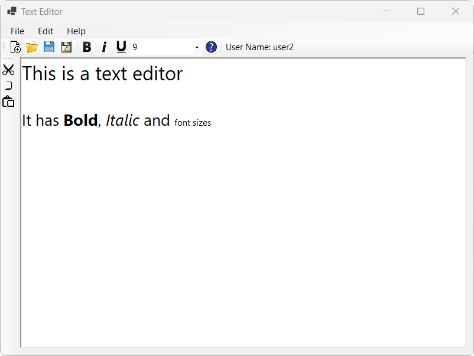

# .Net-Assignment-2
A C# program with the .NET framework created for the Application Development with .NET subject at UTS. 
Designed to be a simple rich text editor allowing the user to login with different user types as well as read and save text files.

